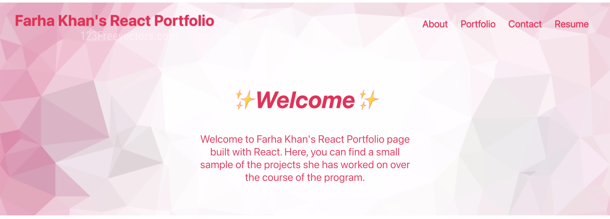
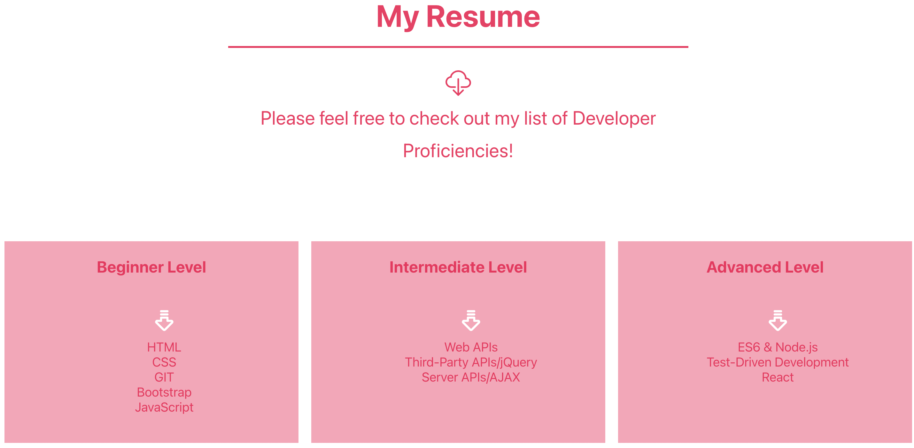

# Modern Development with React: React Portfolio
Challenge 13 : This Challenge, we'll use what we've learned in this module to develop the initial scaffolding of my portfolio site from scratch using React.

## Table of Contents
- [Modern Development with React: React Portfolio](#modern-development-with-react-react-portfolio)
  - [Table of Contents](#table-of-contents)
  - [Project Requirements](#project-requirements)
  - [Project Description](#project-description)
  - [Installation](#installation)
  - [Deployment](#deployment)
  - [Usage](#usage)
  - [Image Links of this Project:](#image-links-of-this-project)
  - [Video Links of this Project:](#video-links-of-this-project)
  - [Application GitHub URL:](#application-github-url)
  - [Application Deployed live URL:](#application-deployed-live-url)

 ##  Project Requirements
 
Each of the following components must follow these guidelines:
  * App:
    * Must be your top-level component and render all necessary child components
  
  * Header:
    * Must be rendered across every page component of the site
    * Must contain a Navbar
  
  * Home page:
    * This should be a welcome landing page that contains:
    * Name   
    * A headshot of you (or an avatar)
    * Your brand statement
    * Some indication that this is your portfolio site
  
  * Projects page:
    * Must be a reusable component that ingests JSON data as props and renders a single instance for each project
    * Must utilize Router props to properly render the right project based on user selection
    * Must render the following info:
    * Project title
    * Link to the deployed version
    * Link to the GitHub repository
    * GIF or screenshot of the deployed application
   
  * Contact page:
    * Must include contact information:
    * Email address
    * Link to a PDF version of your CV
    * Link to your GitHub profile
    * Link to your LinkedIn page
    * Must have a contact form for handling events

 ## Project Description 

  * This is my portfolio created with React.js. It contains an About page, Portfolio page, Contact page, and Resume page.
  * The About page contains a liitle description about me and one my image.
  * The Portfolio page contains a list of five of my favorite applications such as Weather Dashboard, Work Day Scheduler, Team Profile Generator, Combination Of Recipe Movie and Bootstrap Portfolio.
  * The Contact page contains my address, email and form to contact me test.
  * The Resume page contains a link to my resume and a list of my proficiencies. 
  * Lastly in the footer are links to my Github, LinkedIn, and Twitter.

## Installation

1. Clone the repository from GitHub
2. Install `node.js`
3. Run `npm install` to install dependencies. 
4. Run `npm start` to start the web server and connect

## Deployment

1. Create an empty repository on GitHub
2. Create a React app `create-react-app react-portfolio`
3. Install the gh-pages npm package `npm install gh-pages --save-dev`
4. Add a homepage property to the package.json file
5. Add deployment scripts to the package.json file
6. Add a "remote" that points to the GitHub repository
7. Push the React app to the GitHub repository `npm run deploy`
8. Configure GitHub Pages
9. (Optional) Store the React app's source code on GitHub

## Usage

To create a portfolio, using React Technology. The user can review in this portfolio, About Me section see my image and some more information about me, a sample Portfolio and can see my work, a contact form and can contact me, and be able to download the Resume by download resume page.

## Image Links of this Project:

## Video Links of this Project:

## Application GitHub URL:
[README Generator GitHub Link](https://github.com/khnfarha1987/React_Portfolio)

## Application Deployed live URL:
[README Generator Deployed Link](https://khnfarha1987.github.io/React_Portfolio/)